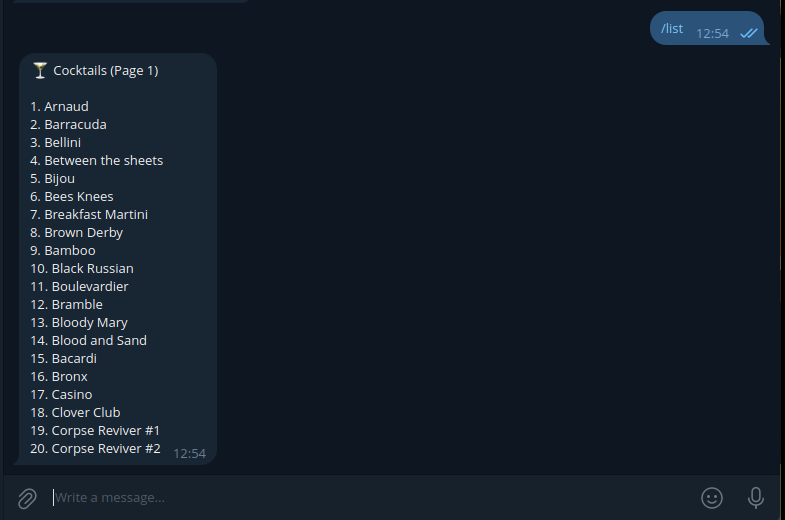
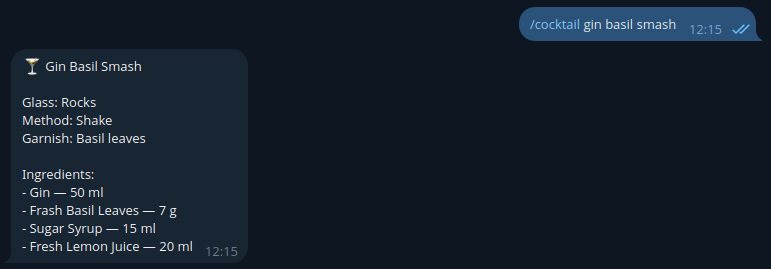

# 🍸 Cocktail Manager Bot

Telegram bot for managing a cocktail database.

Designed for bartenders and bar managers to store, search, and manage cocktail recipes efficiently.

Supports full CRUD operations with a structured ingredient system and FSM-based input flow.
---

## 🚀 Features

### Core functionality

- ➕ Add cocktails via FSM (step-by-step input)
- 📋 List cocktails with pagination
- 🔍 Search cocktails by name or ingredients
- 🍸 View full cocktail recipes
- ❌ Delete cocktails (admin only)
- ✏️ Edit cocktail fields (admin only)

---

### Ingredient system

Each ingredient has a structured format:

name: str
amount: int
unit: str (ml, dash, pcs, g)
comment: optional (e.g. on_top)

Examples:

Gin 30 ml 
Angostura 2 dash 
Tonic 80 ml on_top 

---

## 🧠 Architecture

The project follows a layered architecture:

handlers → services → repositories → database

- handlers — Telegram interaction (aiogram, FSM)
- services — business logic and validation
- repositories — database access layer (PostgreSQL)
- schemas — Pydantic models

---

## 🛠️ Tech Stack

- Python 3.10+
- aiogram (FSM)
- PostgreSQL
- psycopg
- Pydantic

---

## ⚙️ Setup

### 1. Clone repository

```
git clone https://github.com/SalminStepan/cocktail_manager_bot_tg.git
cd cocktail_manager_bot_tg
```

### 2. Create virtual environment

```
python -m venv .venv
source .venv/bin/activate
```

### 3. Install dependencies

```
pip install -r requirements.txt
```
---

### 4. Configure .env
Create .env file:
```
BOT_TOKEN=your_token
DB_HOST=localhost
DB_PORT=5432
DB_NAME=cocktails
DB_USER=postgres
DB_PASSWORD=your_password
ADMIN_IDS=123456789
```

---

## 🗄️ Database setup

Create database and apply migrations:
```
createdb cocktails
psql -d cocktails -f db/migrations.sql
```

---

## 🌱 Seed data
Populate database with sample cocktails:
```
python -m scripts.seed_cocktails
```

---

## ▶️ Run bot
```
python -m bot.bot
```
---


## 🤖 Commands

### General
- /start — welcome message  
- /help — list of commands  

### Cocktails
- /list — show cocktails (with pagination)  
- /cocktail <name> — show recipe  
- /search <query> — search cocktails  

### Admin
- /add — create cocktail  
- /edit <name> — edit cocktail fields  
- /delete <name> — delete cocktail  

---

## 🔐 Permissions
Admin-only commands:
```
/add
/edit
/delete
```
Admin IDs are configured via .env.

---

## 🧩 Implementation Highlights

- FSM-based input flow for creating and editing cocktails  
- Transaction-safe database operations  
- Case-insensitive search for better UX  
- Whitelist-based update system (prevents unsafe SQL injection)  
- Flexible ingredient parsing (supports units and comments)  
- Layered architecture (handlers → services → repositories)  

---

## 📈 Future Improvements

- Edit ingredients (advanced update flow)  
- Inline keyboard support  
- Image support for cocktails  
- Export to CSV / Google Sheets  
- Logging and monitoring 

---

## 📸 Screenshots

Example of bot usage:




---

## 💡 Motivation

This project was built to simplify cocktail management workflows in bars,
where fast access to structured recipes is critical.

It reflects real-world experience in the hospitality industry combined with backend development skills.

---

## 👤 Author

Stepan Salmin
Junior Python Backend Developer
---
